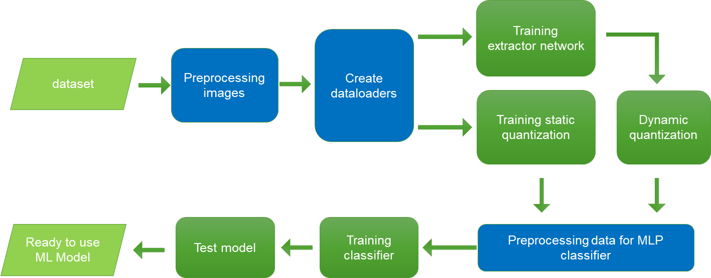
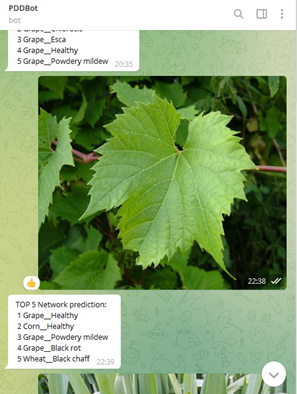
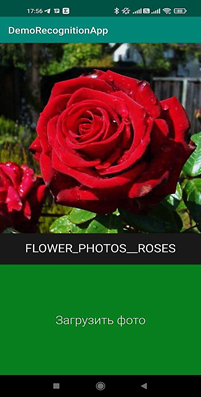

# <div align="center">__**TripletNet recognition system**__</div>
<center></center>

[//]: # (#  <p style="text-align: center;">)


<br>
  <div>
    <br>
    <a href="https://colab.research.google.com/drive/1YhVJfTeCBbMov1Lo_V6XyzMnXP8rraPJ"></a>
  </div>
<br>

## Documentation

See the [Wiki](https://github.com/WEBSTERMASTER777/TripletRecognitionSystem/wiki) for documentation on training, testing and deployment.

<details open>
<summary>Install</summary>

<details open>
<summary> 🛠 Install 🛠</summary>

```console
git clone 
```
1. Install Python **>=3.6.5 and <3.7**
2. Create virtual environment:

```console
python -m venv .env
```

3. Activate environment
    - on windows: `.env\Scripts\activate`
    - on linux/mac: `source .env/bin/activate`

4. Install dependencies:

```console
pip install -r requirements.txt -f https://download.pytorch.org/whl/torch_stable.html
```
</details>

## Description of the system
Our system allows you to train machine learning models on small datasets, and also allows you to get a ready-made quantized model for use on mobile devices



The project contains the following utilities:
* Preprocessing (`pdd/data_utils.py`)
* Utils for create dataloaders
   * Split datasetutils (`pdd/train_test_split.py`)
   * Prepare dataloaders utils(`train.py` and `pdd/data_utils.py` )
* Utils for training :
   * Training Triplet extactor model with KNN classifier (`train.py`, `pdd/trainer.py`, `pdd/model.py`, `pdd/tripletttorch.py`)
   * Training MLP classifier for extractor model (`classifier_train.py`)
* Utils for test model (`script.py`, `perceptron_script.py`,`confusion_matrix.py` )
* Utils for quantization
  * Static quantization available only for **MobileNetV2** model and training only on CPU (all files with prefix quant)
  * Dynamic quantization (`dynamic_quantization.py`)

### Usage example
The resulting model can be used for web and mobile applications:
#### Telegram bot:


<div align="center">
</div>
<div align="center">
<a href="https://t.me/PlantDiseaseRecognitionBOT">
   
   </a>
<a href="https://github.com/WEBSTERMASTER777/telegrambot">
   
   </a>
</div>


[//]: # (![img.png]&#40;doc/image/telegram.png&#41;)

<div align="center">
Link: 
<a href="https://t.me/PlantDiseaseRecognitionBOT">
   
   </a>
<a href="https://github.com/WEBSTERMASTER777/telegrambot">
   
   </a>
</div>

#### Android Application

[//]: # (<div align="center">)

[//]: # ()
[//]: # ([//]: # &#40;![img.png]&#40;doc/image/android.png&#41;&#41;)
[//]: # (</div>)

<div align="center">
</div>
<div align="center">
<a href="https://t.me/PlantDiseaseRecognitionBOT">
   
   </a>
<a href="https://github.com/WEBSTERMASTER777/telegrambot">
   
   </a>
</div>
<div align="center">
Link: 
<a href="https://drive.google.com/file/d/1xOYnELaa5x2cDNjoqUbgGbgXsb9DcaeJ/view?usp=sharing">
   
   </a>
<a href="https://github.com/WEBSTERMASTER777/AndroidRecognitionApp">
   
   </a>
</div>


## Custom Dataset and model training

Instruction for dataset loading   and git demo chek in <a href="https://colab.research.google.com/drive/1YhVJfTeCBbMov1Lo_V6XyzMnXP8rraPJ"></a>

## Citation

```
@article{
  title={CLASSIFICATION OF FEATURES ON FLOWER SURFACES USING COMPRESSED MACHINE LEARNING MODELS},
  author={SMETANIN A.A., PERSHUTKIN A.E., DUKHANOV A.V.},
  journal={Top technologies, № 6 -p. 29-34   },
  year={2022}
}
```


